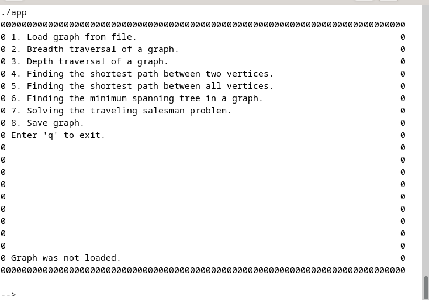
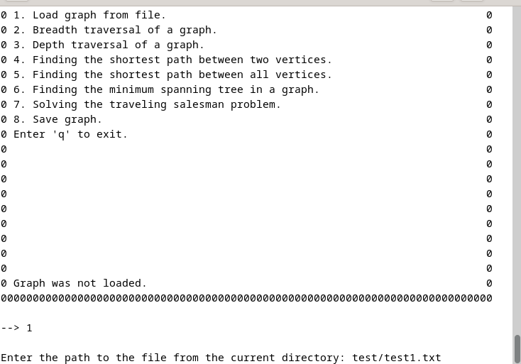
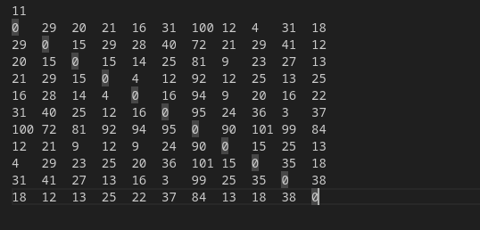
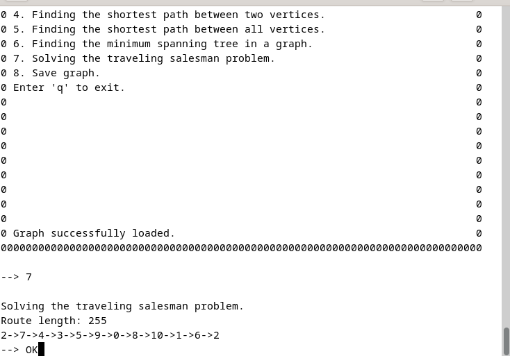
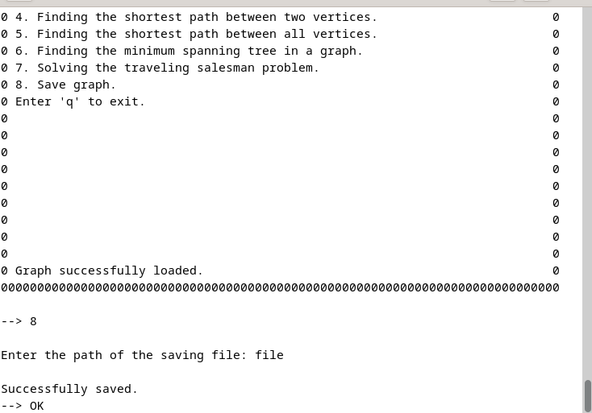
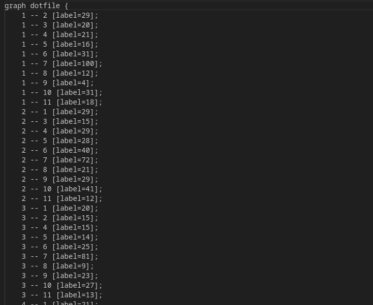

## Graph Algorithms
### Made by Julieanb
## 10.11.2023

- This is the educational project "SimpleNavigator".

- The project is a set of some algorithms with graphs.

- Graphs must meet the following requirements: Edge weights in natural numbers only, 
there may be loops, weights may be different on all edges, only non-zero connected graph.

## Makefile targets

- all: Collects model tests and checks coverage.

- test: Gathers only model tests using gtest.

- gcov_report: Collects model coverage tests. You need gcov/lcov to work.

- install: Installs the application and generates an executable file app in src folder.

- s21_graph.a: Builds a static library containing the graph.

- s21_graph_algorithms.a: Builds a static library containing the graph algorithms.

## Examples

### --I--

The program is presented as a console application.

### --II--

Before starting work, you need to download the graph in the form of an adjacency matrix in a text file format.

### --III--

Below is the result of one of the algorithms.

### --IV--

The program also allows you to save files in .dot format.
